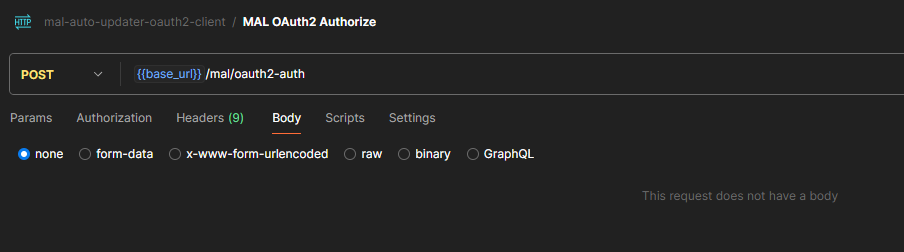
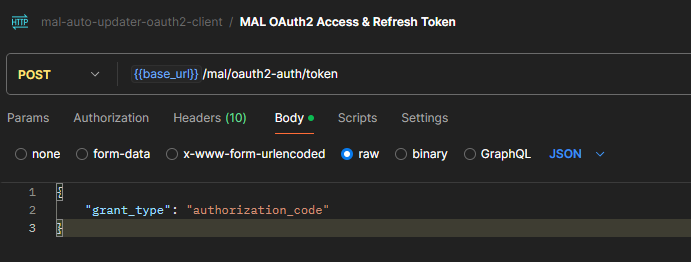
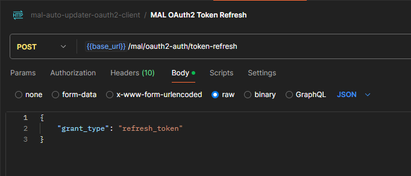

# mal-auto-updater-oauth2-client

Auth client for requesting authorization code, access token, and refresh token
from MAL (MyAnimeList) OAuth2 server and API.

## Auth Flow Guide

For more details, please visit [auth guides](https://myanimelist.net/apiconfig/references/authorization).

## General Application FAQ/ Guides

1. Make sure you have PostgreSQL database server/ instance running on your local environment. It doesn't matter whether
   you use a locally installed database server; docker container database; cloud-based database, as long as you have
   access
   to the database including sufficient database access granted, you are good to go. For reference, you can follow
   this [link](https://www.postgresql.org/download/) to download PostgreSQL.
2. Take notes of the database username, password, host, port, and database name, since we need the specified information
   to be able to connect to the database programmatically.
3. Take a look at `init.sql` query file provided, create a PostgreSQL database and use the query as a starting point for
   the database structure.
4. Next, we also need to make use of ngrok (or any tools which allow port forwarding/ tunneling). For reference, you can
   follow this [link](https://ngrok.com/) to download ngrok.
5. Go to ngrok official website, follow this [link](https://dashboard.ngrok.com/domains) and set up a free domain. The
   domain will
   later be used for port forwarding the local oauth2 client apps.
6. Go to MAL API section, follow this [link](https://myanimelist.net/apiconfig) and set up a new application, which will
   be used to
   configure MAL API client id, client secret, application redirect uri, etc.
7. If the prerequisite is already fulfilled, setup .env file at the root of the project directory based on the provided
   .env.example file, spin up the app (e.g. at localhost port 3000); port forward the locally
   hosted application to the previously configured ngrok domain by using ngrok; register `/mal/oauth2-auth/callback`
   endpoint at the MAL API section, and you are good to go.

## API Endpoint explanation

`POST /mal/oauth2-auth` - Endpoint for requesting oauth2 authorization URL with MAL. Just hit the endpoint, allow
authentication with MAL, and make sure the MAL API has hit the callback url and returning authorization code response.

Usage example in postman:

---

`GET /mal/oauth2-auth/callback` - Endpoint/ callback URL for MAL to return oauth2 authorization code response.

No usage example since this callback endpoint will be called by MAL.

---

`POST /mal/oauth2-auth/token` - Endpoint for exchanging the previously gotten authorization code with access and refresh
token.

Usage example in postman:

---

`POST /mal/oauth2-auth/token-refresh` - Endpoint for refreshing access and refresh token manually.

Usage example in postman:

---

`jobRefreshOauth2Token` - Scheduler to refresh access and refresh token every week/ sunday (the service need to be
running).